# Database Management with Amazon-RDS

### Project Goals.
* Help GatoGrowFast manage its expanding data need with a reliable database solution.
* Teach how to set-up and manage database using Amazon RDS.
* Enable users to handle clients data and project information effectively.

### What is Database

A database is an organized collection of data stored electronically. It uses a database management system (DBMS) to allow efficient data management and retrieval. Data is often organized in tables with rows and columns in relational databases (e.g., MySQL, PostgreSQL). Non-relational databases (NoSQL) like MongoDB and Redis use different structures such as documents, key-value pairs, or graphs. Databases are essential for applications ranging from business record-keeping to web applications and scientific research, enabling the structured and efficient handling of large amounts of data.

### What is a Database Management System

A Database Management System (DBMS) is software that interacts with end users, applications, and the database itself to capture and analyze data. Its primary functions include defining, creating, managing, and querying databases. DBMS ensures data consistency, security, and integrity while providing tools for data backup and recovery. Examples of DBMS include MySQL, PostgreSQL, Oracle, and SQL Server. These systems allow users to efficiently organize, manipulate, and retrieve data, supporting various applications from business operations to web and scientific research.

### What is relational database management system 
A Relational Database Management System (RDBMS) is a type of DBMS that stores data in structured formats known as tables, which are made up of rows and columns. It uses Structured Query Language (SQL) for database access and management. RDBMS ensures data integrity, security, and consistency through ACID properties (Atomicity, Consistency, Isolation, Durability). Common examples include MySQL, PostgreSQL, Oracle, and SQL Server. These systems are ideal for applications requiring complex queries and transactions, such as business operations, financial services, and data analysis.

### Difference between a DBMS and an RDBMS 
A DBMS (Database Management System) is software used to store, manage, and retrieve data in a database. It supports various types of data models, such as hierarchical, network, and object-oriented. An RDBMS (Relational Database Management System) is a specialized type of DBMS that uses a relational model to organize data into tables with rows and columns. It employs Structured Query Language (SQL) for database access and management. Key differences include the use of tables in RDBMS for data structure and SQL for querying, ensuring data integrity through ACID properties, which are not guaranteed by all DBMS types.

## PRACTICALS

* Navigate to the search bar on the AWS console.
* Input RDS on the search bar to locate the RDS service and click on it.

  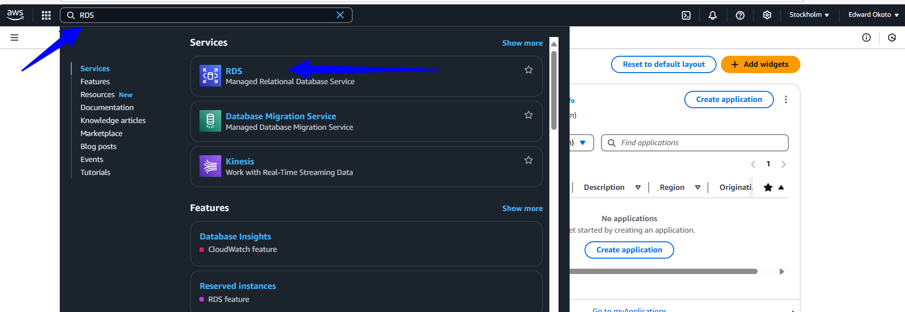

* Navigate to the Database section on the left hand side and click "Create database"
  
    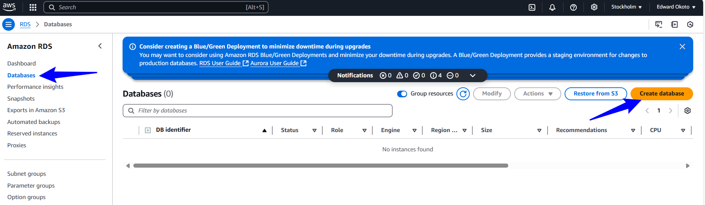

* Select "Standard Create"

     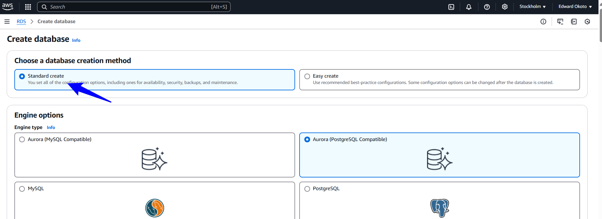

* Choose "MYSQL" database engine

    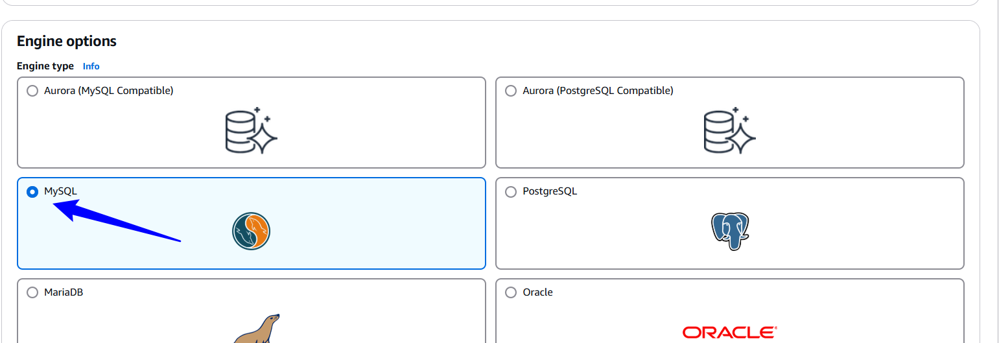

* Select the MYSQL latest version or any preffered version and choose a free tier template

     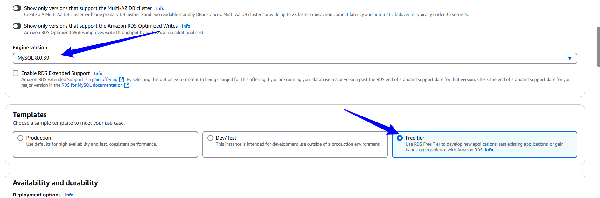

* Specify the Database instance name 
     
      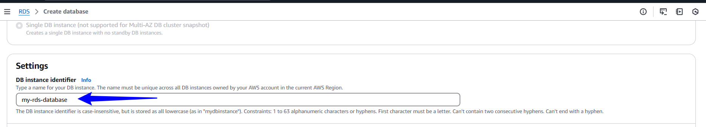

* Select a master username for the database
* Choose the "Credentials Management" as "Self managed"
* Enter the master password and reconfirm the password (keep the username and password safe)

    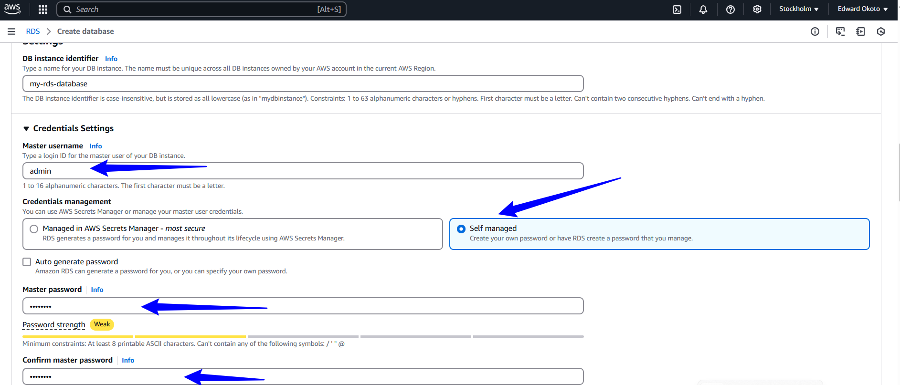

* Choose the Database instance class as " db.t3.micro " and maintain the default settings for the rest of the configuration.
 
     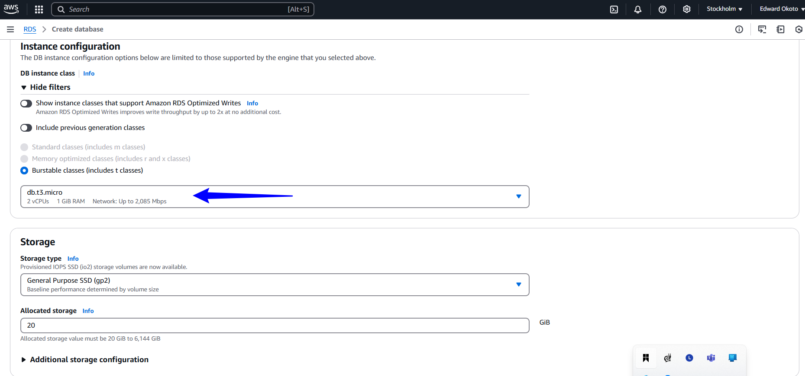

* Choose desired VPC and select "Public access"

     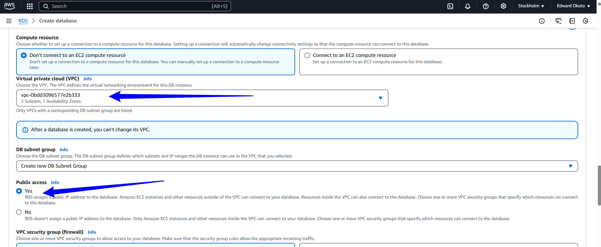

* Choose an existing security group or create a new security group depends on your choice.

  NOTE: Ensure that the security group allows inbound traffic for MYSQL/Aurora on port 3304

   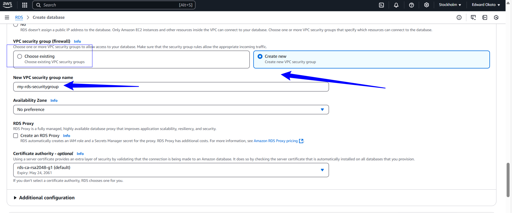

* Click create database
   Database created successfully.

   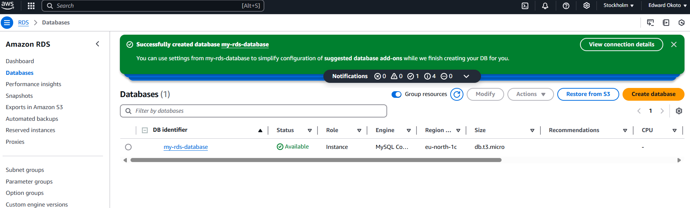

* Click on the database
   
    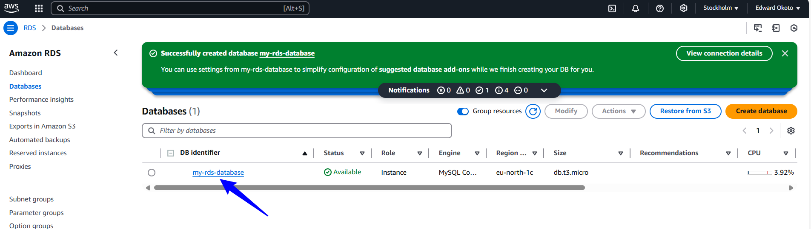

* Click on VPC security groups

     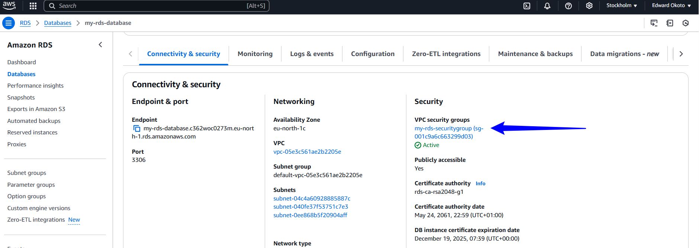

* Click on the security group
     
     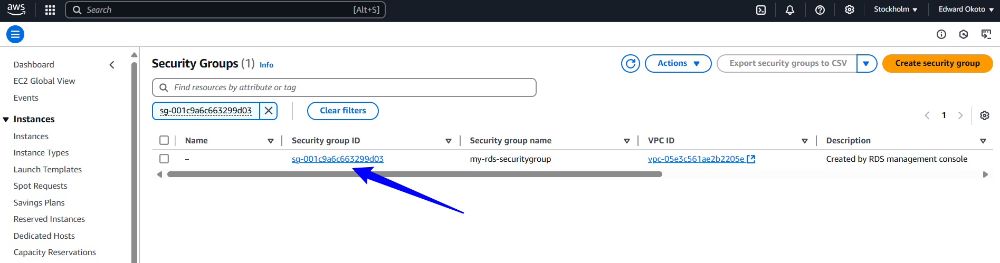

* Click on "Inbound rules" and then "Edit inbound rule"

    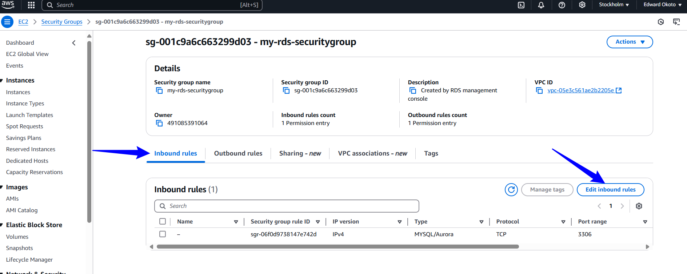

* Add Inbound rule for MySQL/Aurora if not available but ignore if avaialble.

     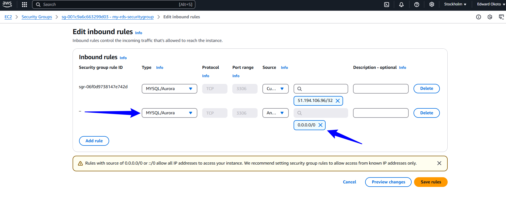

* Click on the database and retriev the End-piont ID and keep safe along with the database username and password.

     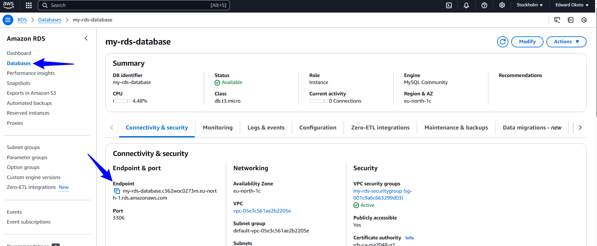

* NEXT ,create an EC2 instance,log in and run these commands.

  `sudo wget https://dev.mysql.com/get/mysql57-community-release-el7-11.noarch.rpm`

   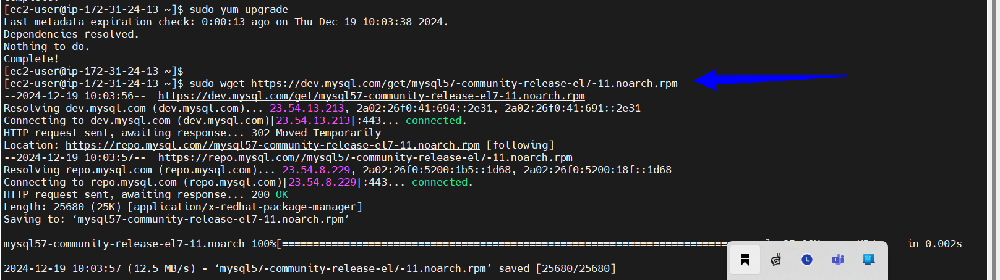

  `sudo yum localinstall mysql57-community-release-el7-11.noarch.rpm`
   
   Click Yes when prompted
   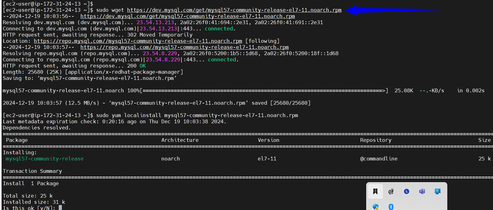

  `rpm --import https://repo.mysql.com/RPM-GPG-KEY-mysql-2022`

    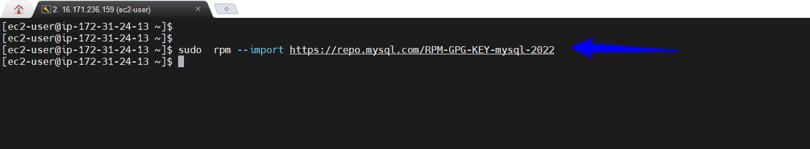

    `sudo yum install mysql-community-server`

    Type "Yes" when prompted.

    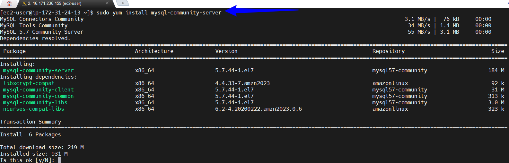

  `sudo systemctl start mysqld.service` 
  
  `sudo systemctl enable mysqld.service` 
  
  `sudo systemctl status mysqld.service`

   You can press "q" to quit after running the status command.

   
    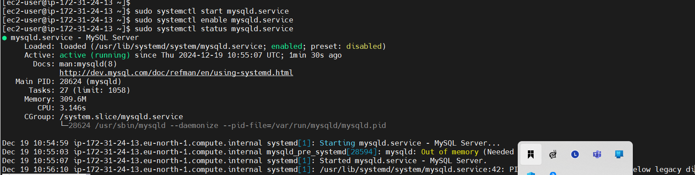

###  CONNECT TO THE RDS AFTER SETTING UP THE EC2 INSTANCE

"mysql -h [Endpoint] -P [Port] -u [username] -p[Password] "

NB:Please tailor this command to meet your parameters

` mysql -h my-rds-database.c362woc0273m.eu-north-1.rds.amazonaws.com -P 3306 -u admin -padmin123`

   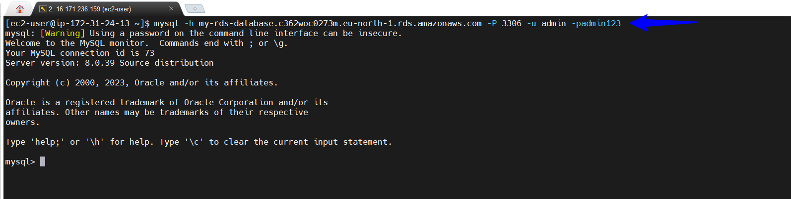

 If you want to view all databases,run:

 `SHOW DATABASES;`

  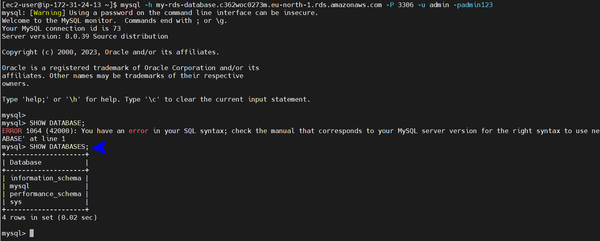

 To use the database you have created,execute

 `USE mysql;`
   
   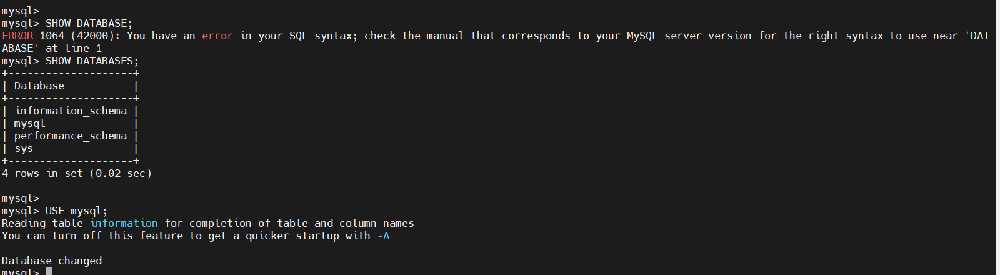

 if you want to show tables inside the database,use

 `SHOW TABLES;`

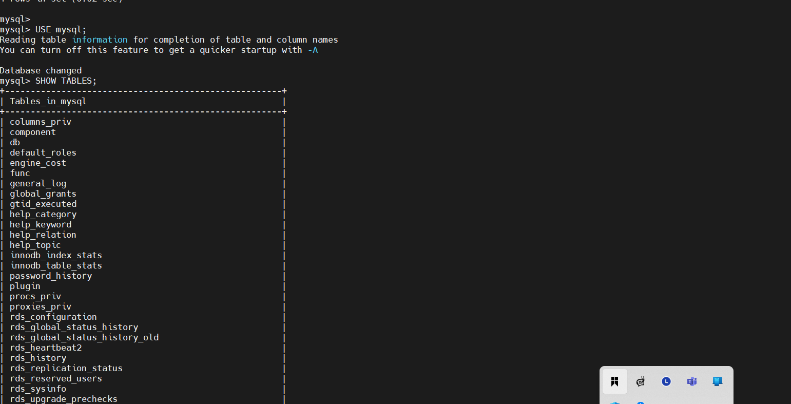

WE HAVE SUCCESSFUL CREATE OUR DATABASE AND CONNECTED IT TO AN EC2 INSTANCE.

# PROJECT REFLECTIONS:

This project highlighted the importance of a reliable database system for companies as they expand. Participant got practical experience setting up database using Amazon RDS.

  

